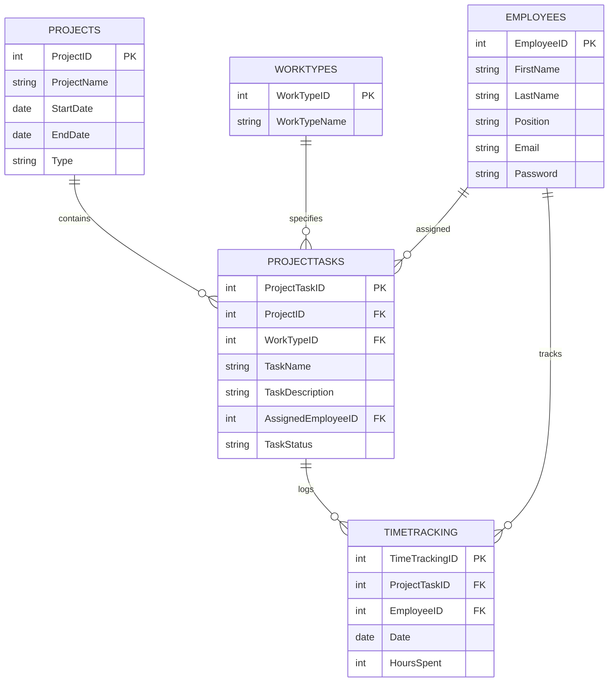

```mermaid
erDiagram

    PROJECTS {
        int ProjectID PK
        string ProjectName
        date StartDate
        date EndDate
        string Type
    }
    
    WORKTYPES {
        int WorkTypeID PK
        string WorkTypeName
    }
    
    EMPLOYEES {
        int EmployeeID PK
        string FirstName
        string LastName
        string Position
        string Email
        string Password
    }
    
    PROJECTTASKS {
        int ProjectTaskID PK
        int ProjectID FK
        int WorkTypeID FK
        string TaskName
        string TaskDescription
        int AssignedEmployeeID FK
        string TaskStatus
    }
    
    TIMETRACKING {
        int TimeTrackingID PK
        int ProjectTaskID FK
        int EmployeeID FK
        date Date
        int HoursSpent
    }

    PROJECTS ||--o{ PROJECTTASKS : contains
    WORKTYPES ||--o{ PROJECTTASKS : specifies
    EMPLOYEES ||--o{ PROJECTTASKS : assigned
    PROJECTTASKS ||--o{ TIMETRACKING : logs
    EMPLOYEES ||--o{ TIMETRACKING : tracks

```
